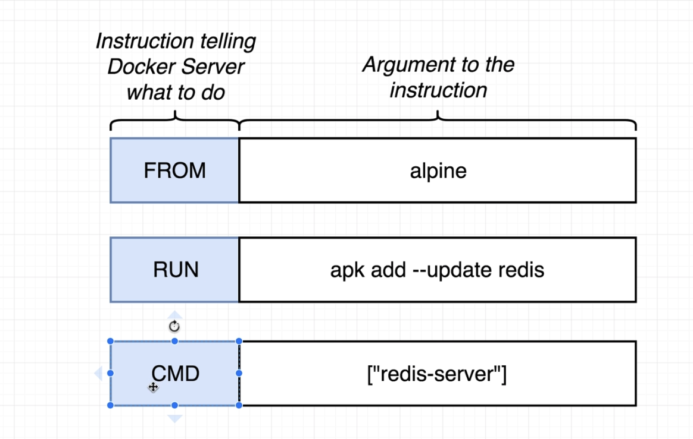

[What Docker is trying to solve](https://www.notion.so/What-Docker-is-trying-to-solve-2414cb4c202f4666801ec6bd8c0d8728)

[What is Docker?](https://www.notion.so/What-is-Docker-380efd99f4c1443f8f4ccbcc7ad876a1)

[When I run docker](https://www.notion.so/When-I-run-docker-6f5f4da688c544ff80060215d3ee17d8)

[What is container](https://www.notion.so/What-is-container-7bc05945a26a4b39a62cd9999e0440ab)

[How docker is running on my OS?](https://www.notion.so/How-docker-is-running-on-my-OS-8f100cf0393c469e835a2c885c7cd605)

[Docker run in detail](https://www.notion.so/Docker-run-in-detail-c9b998723ae24c408f8f69358fed4df2)

[Listing Running Containers](https://www.notion.so/Listing-Running-Containers-ae53afd8386843d9b4ab51700868d5dc)

# Docker Commands

**Docker create vs Run**

Start will start any stopped containers. This includes freshly created containers. Run is a **combination of create and start**. It creates the container and starts it.

```bash
# Run, { Create + Start } 
docker run busybox echo hi there
docker run busybox ls
docker run -it redis 
docker ps -all
docker ps 

# Create Docker & Start
docker create hello-world 
docker start ed9ec97e0a5bb53820befd1df7e46962cff37c0e0edc38ef0c97654e25ce6da4

# Delete all 
docker system prune

# Create Docker & Start & Logs 
docker create busybox echo hi there
docker start c5436daaffade0a2843db578fdfad5f66484d123a9ddb388b0f31007e4f6f0e2
docker logs c5436daaffade0a2843db578fdfad5f66484d123a9ddb388b0f31007e4f6f0e2

# Create & Start & Stop 
docker create busybox ping googe.com
docker start aafd03cc851a518818e51c985e913bd1949608710b2194ee787fa53da83bede8
### Stop a container
docker stop aafd03cc851a518818e51c985e913bd1949608710b2194ee787fa53da83bede8
### Kill a container 
docker kill aafd03cc851a518818e51c985e913bd1949608710b2194ee787fa53da83bede8
```

### Docker are separate

```bash
# terminal 1
docker run -it busybox sh
touch helloworld.txt
ls # can find helloworld.txt 

# terminal 2
docker run -it busybox sh
ls # can't find helloworld.txt
```

### Starting with a Shell

```bash
docker run -it busybox sh
```

### sh

```bash
docker exec -it d9b896c46528 sh 
```

- Name of program
    - bash
    - powershell
    - zsh
    - sh

# The purpose of 'it' Flag

- to run commands inside container

```bash
docker run redis

###
CONTAINER ID   IMAGE          COMMAND                  CREATED              STATUS              PORTS      NAMES
d9b896c46528   redis          "docker-entrypoint.s…"   About a minute ago   Up About a minute   6379/tcp   admiring_jepsen
30dbced3271a   busybox        "ping google.com"        18 hours ago         Up 18 hours                    vibrant_ride
f18a039b9397   58a2998e6f5a   "/usr/bin/dumb-init …"   19 hours ago         Up 19 hours                    k8s_controller_ingress-nginx-controller-576bcb66fd-jw5xq_ingress-nginx_0f6d29c6-b73d-47a6-ad71-0a9c24247f01_20
### 

docker exec -it d9b896c46528 redis-cli

```

```bash
docker exec -i -t ${container_id} ${commands you want to execute} 
docker exec -it ${container_id} ${comman ds you want to execute}
```

# Docker file

- Configuration to define how our container should behave

### Create a Dockerfile

- Specify a base image
- Run some commands to install additional programs
- Specify a command to run on container startup

# Dockerfile

- Dockerfile

```docker
# Use an existing docker image as a base 
FROM alpine 

# Download and install a dependency
RUN apk add --update redis 

# Tell the image what to do when it starts
# as a container 
CMD ["redis-server"]
```

- commands

```bash
docker build . 
```

⇒ inside directory 

# Dockerfile Teardown



```bash
# Use an existing docker image as a base 
FROM alpine 

# Download and install a dependency
RUN apk add --update redis # Not a docker command 

# Tell the image what to do when it starts
# as a container 
CMD ["redis-server"]
```

# The build process in Detail


# Tagging

```bash
docker build t paigeshin1991/paige-redis:latest
docker build t paigeshin1991/paige-redis
```

# Manual Image Generation with Docker Commit

- not recommended to use

```bash
# Use an existing docker image as a base 
FROM alpine 

# Download and install a dependency
RUN apk add --update redis # Not a docker command 
RUN apk add --update gcc 

# Tell the image what to do when it starts
# as a container 
CMD ["redis-server"]
```

```bash
docker run -it alpine sh
apk add --update redis
apk add --update gcc 
```

```bash
docker ps -all 
# Take a snapshot 
docker commit -c 'CMD ["redis-server"]' 7cf5b42104e1
# output: sha256:790dfed7d5798c8cf10ae524417e31bb8a24efaf9615a204f73f2ef641527f76
docker run 790dfed7d5798c8cf10ae524417e31bb8a24efaf9615a204f73f2ef641527f76
```

# Mini Project

- Create NodeJS Web App
- Create a Dockerfile
- Build image from dockerfile
- Run image as container
- Connect to web app from a browser

### Create Node Server


```docker
# Specify a base image
FROM node:alpine

WORKDIR /usr/app

# Install some dependencies 
COPY ./ ./
RUN npm install 

# Default command
CMD ["npm", "start"]
```

```bash
docker build -t paigeshin1991/simpleweb .
docker push paigeshin1991/simpleweb 
docker run -p 5000:8080 paigeshin1991/simpleweb
```

5000 redirected to 8080 

# Minimizing Cache Busting

```docker
# Specify a base image
FROM node:alpine

WORKDIR /usr/app

# Install some dependencies 
# COPY ./ ./
COPY ./package.json ./
RUN npm install 
COPY ./ ./ 

# Default command
CMD ["npm", "start"]
```
